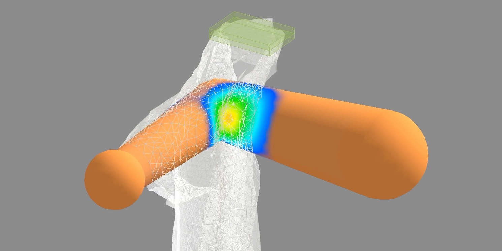

# learning-forces

Reference code for the paper [What Does the Person Feel? Learning to Infer Applied Forces During Robot-Assisted Dressing](http://pwp.gatech.edu/hrl/wp-content/uploads/sites/231/2017/03/erickson2017-learning-forces.pdf).

  

### Compiling on Linux?
```bash
./build_linux.sh
```

### Test out force map estimation
You can try out our pretrained models by running:
```
cd physx_simulation/pysim/
python gownforcemaps.py
python shortsforcemaps.py
```

### Full training process
Record 5,400 dressing sequences for both dressing tasks. This takes several hours on Amazon EC2:
```bash
python autogown.py 150
python autoshorts.py 150
```

Edit the last two lines in `datapreprocess.py`:  
Replace `2016-08-31_arm` and `2016-09-06_leg` with the respective directories created from data collection above.

Run `python datapreprocess.py`

Edit the last two lines in `learning.py` so that the linked directories match the new ones created by `datapreprocess.py`.

Run `python learning.py`

Edit the second to last lines in both `gownforcemaps.py` and `shortsforcemaps.py` to link to the new directories created by `learning.py`.

Run `python gownforcemaps.py` or `python shortsforcemaps.py` to test out the newly trained LSTMs for force map estimation.

### Quantitative Results
`variationtestvizmse.py` will generate all of the plots presented in the paper.

The test set data for these plots can be regenerated via:
```bash
python variationtestgown.py
python variationtestshorts.py
```

### Setting up on Amazon EC2?
Checkout this [GitHub repository](https://github.com/Zackory/zackory-setup/blob/master/setupEC2.sh) for setup scripts and necessary dependency installations.


### Prerequisites
`python 2.7`  
`Keras`  
`SciPy`  
`Tensorflow` or `Theano`  
`plotly`  
`PyOpenGL - 3.1.0 or greater`  
`PyOpenGL_accelerate`  
`pybind11`  
`HDF5`  
`h5py`  
`DART`  
`Eigen (C++ library)`  

